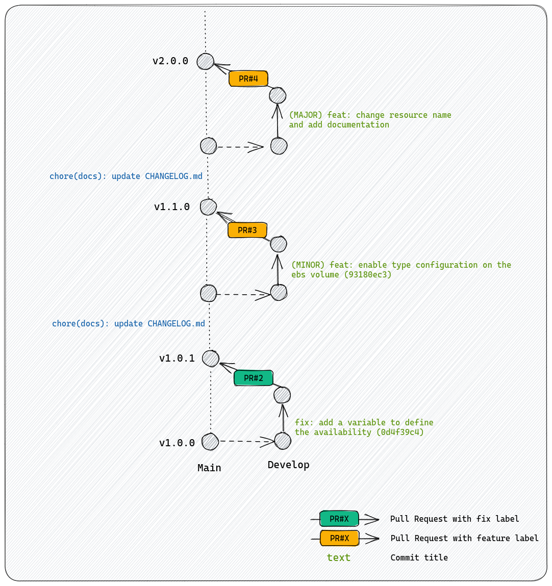

# terraform-aws-example

This repository is an example (terraform module example) of how to automate the creation of git repository tags and release.

To get more information about how does this repository work, you can take a look to the Medium article : [Tags & Releases automation](https://medium.com/@le_moment_it/tags-releases-automation-77678047c79e)

## Repository lifecycle

To show a clean example of how the semantic versioning CI/CD works, you can take a look to the following schema. This schema represents all commits and updates that have been done on this repository. According to the importance of the commit, the CI/CD will update the version tag accordingly :

## One more thing ...

This workflow and this article is the result of researches done on my Twitch channel : [@le_moment_it](https://www.twitch.tv/le_moment_it) . 

If you want to support me for free, you can follow the channel and join us for more IT research !

We live every Tuesday and Thursday at 15h PM (UTC+1).

To finish, we also have a discord where we share IT news and articles. You can join us here : [le_moment_it](https://discord.gg/Bn66XZsWfn)